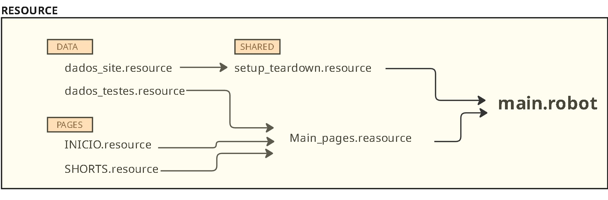

<p align="right">
  <a href="#automação-youtube-com-robot-framework-pt-br">🇧🇷 Português</a> | 
  <a href="#youtube-automation-with-robot-framework-en-us">🇺🇸 English</a>
</p>

<a name="br-português"></a>

# Automação YouTube com Robot Framework (PT-BR)


Este projeto tem como objetivo praticar automações web utilizando as bibliotecas Browser e String do Robot Framework. 

## Tecnologias

* Robot Framework: Framework de automação
* Browser Library: Biblioteca para automação web
* String Library: Biblioteca para manipulação de textos e strings
* Python

## Cenários de Teste

* Cenário 1: Pesquise o canal do YouTube e acesse-o.
* Cenário 2: Ele recebe um ou mais títulos de vídeo e os pesquisa um por um na barra de "Pesquisa". Finalmente, retorna uma caixa de mensagem informando o número da pesquisa realizada.

> Nota: Caso esse projeto rode em um youtube cujo idioma não seja Português-BR, o valor atribuído para "Get Element States" precisa ser alterado.

* Cenário 3: Digite o nome de um vídeo, verifique se há uma lista de opções e escolha a primeira opção dessa lista.

* Cenário 4: Acesse a página "shorts" e reproduza um número de vídeos, dependendo da variável ```${NUMBER_OF_SHORTS}```. Os vídeos mudam após serem reproduzidos por pelo menos 95% do seu tempo.

## Estrutura do RESOURCE




### Inicialização e execução do projeto

1. Declare as variáveis em ```/RESOURCE/DATA/dados_testes.resource``` conforme recomendações dos comentários 
2. Crie um ambiente virtual (venv)
3. Faça as instalações e inicialize o browser:

```
pip install robotframework

pip install robotframework-browser 

rfbrowser init
```
4. Rode: 

```
#Todos os cenários

robot -d results main.robot

#Apenas um cenário via tag (coloque o nome da tag)

robot -d results -i [name_tag] main.robot


```

---

<a name="en-english"></a>


# YouTube Automation with Robot Framework (EN-US)


This project aims to practice web automation using the Browser and String libraries from Robot Framework.

## Technologies

* Robot Framework: Automation framework.

* Browser Library: Next-generation web testing library (Playwright-based).

* String Library: Library for text and string manipulation.

Python

## Test Scenarios

* Scenario 1: Search for a YouTube channel and access it.

* Scenario 2: Receives one or more video titles and searches for them one by one in the search bar. Finally, returns a message box stating the number of searches performed.

> Note: If this project runs on a YouTube version where the language is not Portuguese-BR, the value assigned to "Get Element States" must be updated to match the localized element attributes.

* Scenario 3: Type a video name, verify if a recommendation list appears, and select the first option from that list.

* Scenario 4: Access the "Shorts" page and play a specific number of videos based on the ```${NUMBER_OF_SHORTS}``` variable. The videos skip automatically after playing for at least 95% of their duration.

## RESOURCE Structure


### Project Initialization and Execution

1. Declare the variables in ```/RESOURCE/DATA/dados_testes.resource``` as recommended in the comments.
2. Create a virtual environment (venv)
3. Install dependencies and initialize the browser:

```
pip install robotframework

pip install robotframework-browser 

rfbrowser init
```
4. Run the tests: 

```
#Run all scenarios

robot -d results main.robot

#Run a specific scenario by tag (replace [name_tag])

robot -d results -i [name_tag] main.robot


```